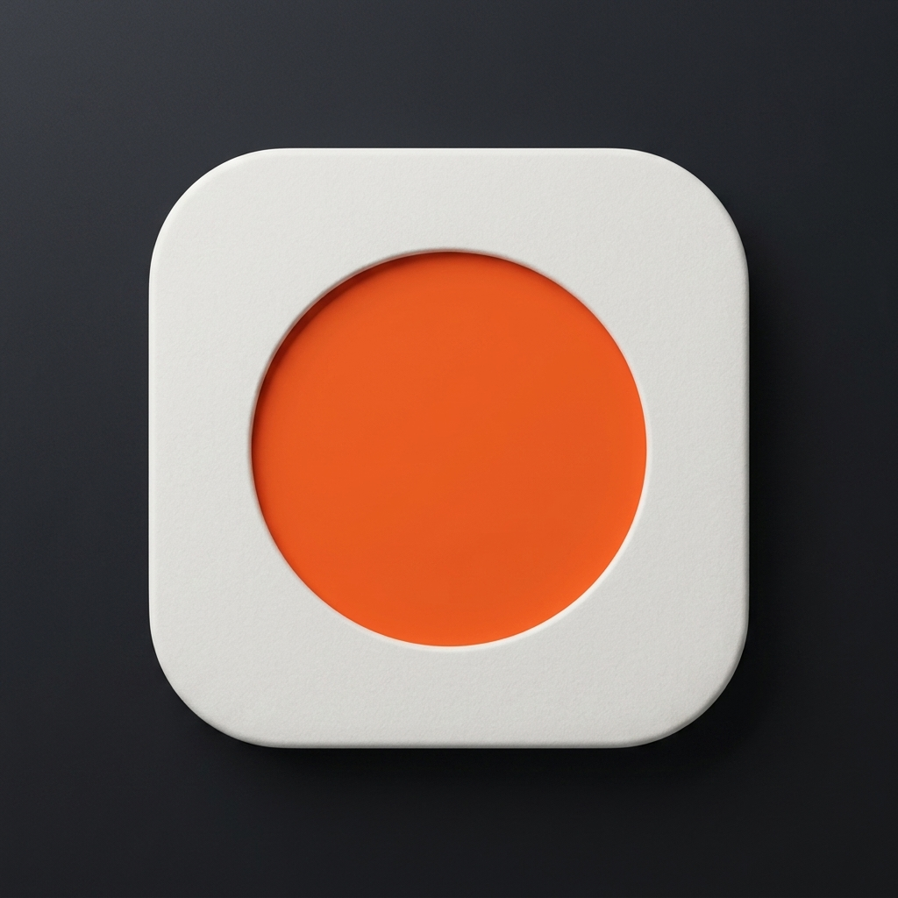
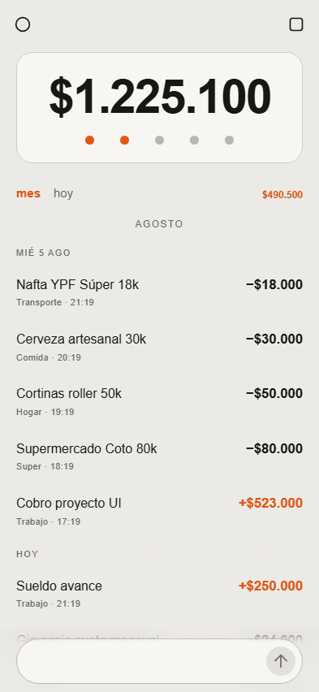
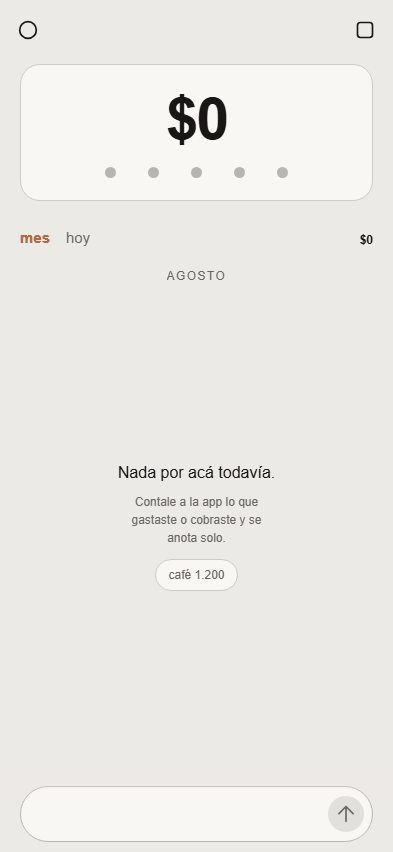
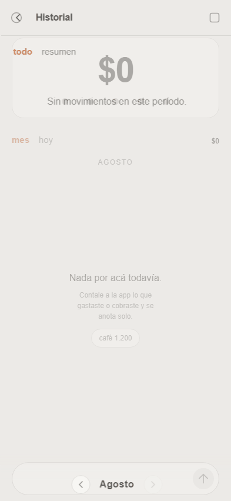
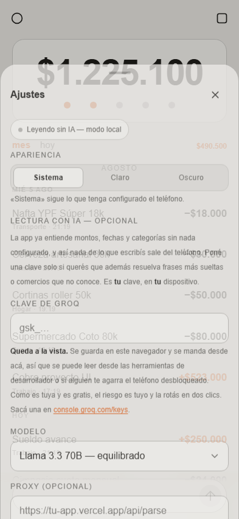

# Spens

<p align="center">
  
</p>

<p align="center">
  <strong>Gestión de gastos e ingresos conversacional en español argentino.</strong><br />
  100% privado · Sin servidores · PWA Instalable · Diseño minimalista Braun
</p>

<p align="center">
  <a href="https://felivander.github.io/SPEN/"></a>
  <a href="#-instalar-en-el-celular"></a>
</p>

---

## 🎬 Demostración en Tiempo Real

| **1. Ingreso de Gastos en Vivo** | **2. Menú de Rango Expandible** |
| :---: | :---: |
|  |  |
| *Ingreso en lenguaje natural es-AR (`hamburguesa 6.500`)* | *Despliegue animado `anteayer` · `ayer` · `hoy`* |

| **3. Resumen y Gráficos Mensuales** | **4. Modo Claro / Oscuro / Sistema** |
| :---: | :---: |
|  |  |
| *Desglose por categoría y consulta de meses* | *Cambio de apariencia en vivo* |

---

## 📸 Vistas Principales

| **Dashboard Principal** | **Categorías e Historial** |
| :---: | :---: |
|  |  |

---

## ⚡ Características Clave

- 🗣️ **Parser Conversacional Rioplatense**: Entiende `15 mil`, `2 lucas`, `5k`, `2 palos`, palabras escritas (`dos mil`), cobros (`cobré 180k`), y fechas relativas (`ayer`, `anteayer`, `12/3`).
- ☁️ **Sincronización en la Nube con Supabase & Google**: Iniciá sesión con tu cuenta de Google para respaldar y sincronizar automáticamente tus gastos entre múltiples dispositivos.
- 🗓️ **Filtros por Fecha**: Si tenés seleccionada la pestaña `ayer` o `anteayer`, los nuevos gastos ingresados se asignan automáticamente a ese día.
- 🏷️ **Edición de Categorías**: Tocá cualquier item para cambiar su categoría en tiempo real con selector horizontal de chips con *glassmorphism*.
- 🤏 **Gestos Táctiles Naturales**: Deslizá hacia abajo para cerrar Ajustes con resistencia elástica (*rubber-band*), o arrastrá de izquierda a derecha para cerrar el Historial.
- 🔒 **100% Funcional Offline (Local-First)**: Funciona sin conexión con `localStorage`. Si iniciás sesión, tus datos se respaldan en Supabase.
- 🎨 **Estética Dieter Rams**: Paleta cálida basada en OKLCH, tipografía Helvetica limpia, sin sombras pesadas y color acento naranja Braun.

---

## 🚀 Desarrollo Local

```bash
# Clonar e instalar
git clone https://github.com/Felivander/SPEN.git
cd SPEN
npm install

# Servidor de desarrollo
npm run dev

# Compilar para producción
npm run build
```

---

## 📲 Instalar en el Celular

1. Entrá a **[https://felivander.github.io/SPEN/](https://felivander.github.io/SPEN/)** desde tu celular.
2. En Safari/Chrome: **Compartir** ➔ **Agregar a pantalla de inicio**.
3. Abrilo como una App nativa sin barras de navegador.

---

## ⚙️ Stack Tecnológico

`React 18` · `TypeScript` · `Vite` · `Vanilla CSS (OKLCH)` · `vite-plugin-pwa` · `Iconoir` · `Playwright`
