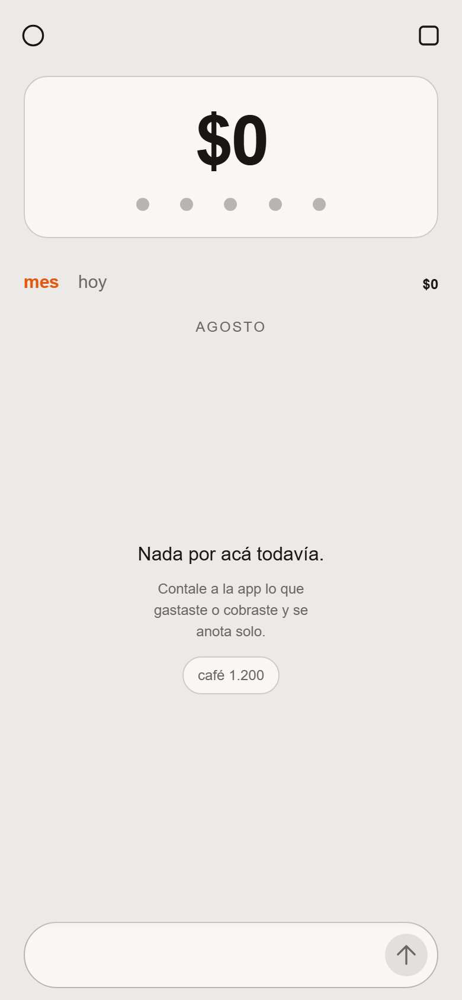
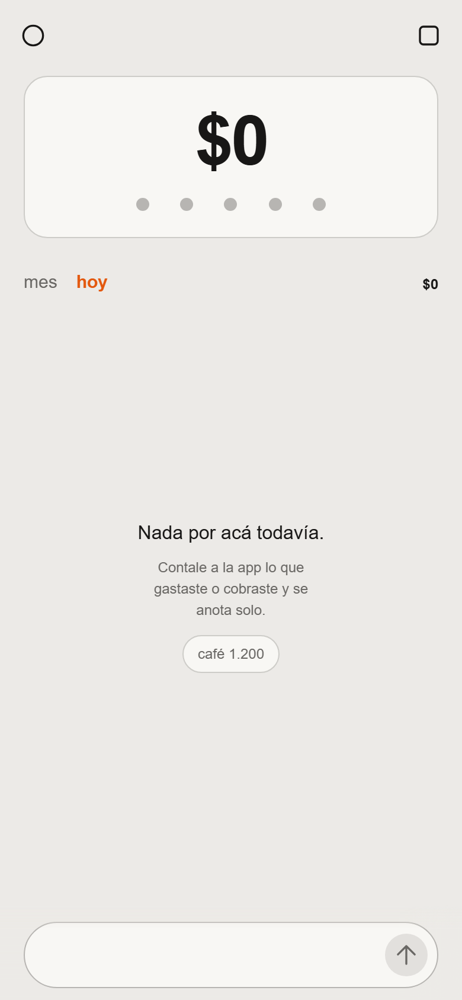
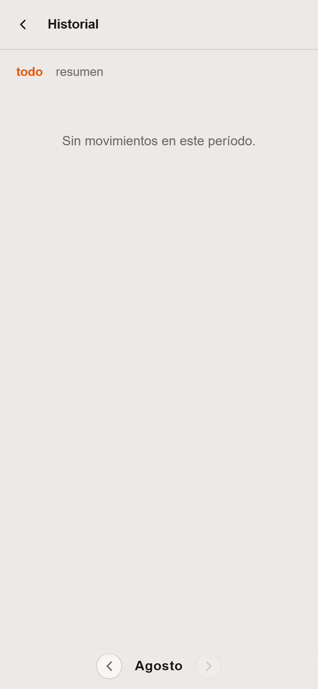
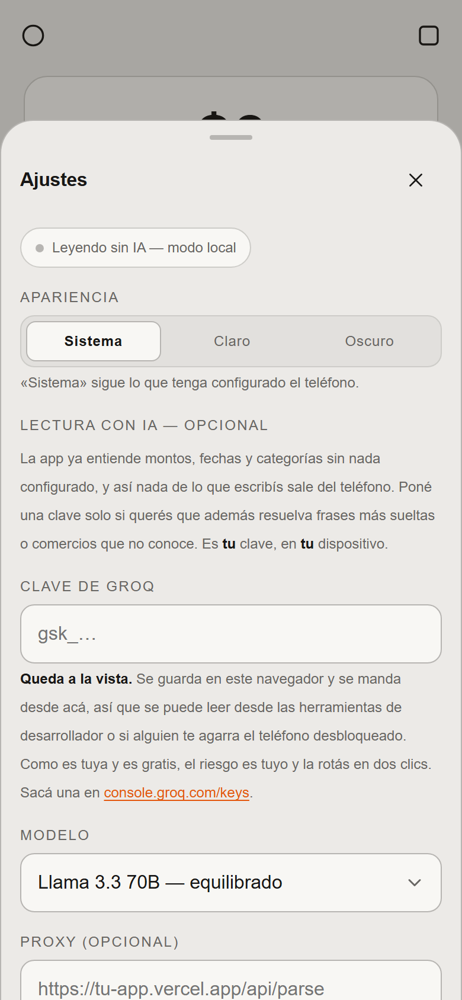

# Spens

> **Gastos e ingresos anotados de forma natural, en castellano argentino.**  
> 100% privado, ultra rápido, funciona sin conexión y se instala en la pantalla de inicio como una App nativa.

---

## 📸 Vista Previa

| **Pantalla Principal** | **Filtros Rápidos** |
| :---: | :---: |
|  |  |
| *Saldo neto, contador visual de gastos y chat* | *Navegación fluida por `anteayer` · `ayer` · `hoy`* |

| **Historial Completo** | **Ajustes y Gestos** |
| :---: | :---: |
|  |  |
| *Consulta mensual y desglose por categorías* | *Ajustes de IA, temas y exportación JSON* |

---

## ✨ Características Principales

- 🗣️ **Parser conversacional es-AR**: Escribí como hablás (`hamburguesa 4500`, `nafta 15k`, `ayer farmacia 9800`, `cobré 180 mil`). Entiende modismos locales, números en palabras y movimientos múltiples en un mismo mensaje.
- ⚡ **Lector 100% Local y Offline**: Sin servidores ni APIs externas obligatorias. Procesa instantáneamente todo en tu dispositivo sin consumir datos.
- 🗓️ **Filtros y Navegación Inteligente**: Alterná entre vista mensual y semanal. Al presionar `hoy`, el menú se despliega animadamente a la izquierda mostrando `anteayer` y `ayer`.
- 🏷️ **Reasignación de Categorías**: Tocá cualquier movimiento para cambiar su categoría al instante con un selector horizontal de chips con efecto *glassmorphism*.
- 🤏 **Gestos Táctiles Naturales**: Deslizá hacia abajo para cerrar los Ajustes con resistencia elástica (*rubber-band*), o arrastrá de izquierda a derecha para cerrar el Historial.
- 🎨 **Estética Braun / Dieter Rams**: Paleta cálida basada en OKLCH, tipografía limpia, sin sombras pesadas y un único color acento naranja para señalar movimientos de dinero.
- 📲 **PWA Instalable**: Agregalo a la pantalla de inicio de tu iPhone o Android y usalo como una App nativa sin barra de navegador.

---

## 💬 Ejemplos de Mensajes Soportados

Podés escribir mensajes simples o complejos en el chat:

```text
café 1.200
nafta 15 mil y super 8.400
ayer farmacia 9800
cobré 180 mil del freelance
hamburguesa mostaza 4.500
```

### ¿Qué reconoce el parser local?
- **Formatos de dinero**: `1.200` · `1.200,50` · `5k` · `15 mil` · `2 lucas` · `2 palos`
- **Palabras a números**: `dos mil` · `mil quinientos` · `cien mil` · `dos millones`
- **Tipos de movimiento**: Detecta automáticamente ingresos (`cobré`, `me devolvieron`, `sueldo`, `vendí`) y gastos.
- **Fechas relativas**: `ayer`, `anteayer`, `12/3`.
- **Categorización automática**: Más de 200 palabras clave predefinidas (comida rápida, super, transporte, servicios, etc.).

---

## 🚀 Instalación y Desarrollo Local

### Requisitos
- **Node.js**: v18 o superior
- **npm**: v9 o superior

### Pasos

1. **Clonar el repositorio:**
   ```bash
   git clone https://github.com/Felivander/SPEN.git
   cd SPEN
   ```

2. **Instalar dependencias:**
   ```bash
   npm install
   ```

3. **Ejecutar el servidor de desarrollo:**
   ```bash
   npm run dev
   ```
   Abre la app en `http://localhost:5173/SPEN/`.

4. **Compilar para producción:**
   ```bash
   npm run build
   ```

---

## 🌐 Deploy a GitHub Pages

El proyecto incluye un pipeline automatizado con **GitHub Actions** (`.github/workflows/deploy.yml`).

Cada vez que hacés un push a la rama `main`, la app se compila, ejecuta las pruebas de TypeScript y publica automáticamente en:  
👉 **[https://felivander.github.io/SPEN/](https://felivander.github.io/SPEN/)**

---

## 🔒 Privacidad y Exportación de Datos

Todos tus movimientos se almacenan únicamente en el `localStorage` de tu navegador o dispositivo.

- 📥 **Exportar**: Descargá una copia de seguridad en formato `.json` desde la pantalla de Ajustes.
- 📤 **Importar**: Restaurá tus datos en cualquier momento o transfierelos a otro dispositivo.
- 🗑️ **Borrar datos**: Podés limpiar el almacenamiento local con confirmación directa.

---

## 🤖 Integración Opcional con IA (Groq)

Spens no requiere IA para funcionar. Sin embargo, si deseas interpretar frases extremadamente complejas o poco habituales:
- Ingresá tu API Key de **Groq** en la pantalla de Ajustes.
- Tu clave vive únicamente en tu dispositivo y nunca se comparte.

---

## 📐 Stack Tecnológico

- **Core**: React 18 · TypeScript · Vite
- **Estilos**: Vanilla CSS con tokens OKLCH
- **PWA**: vite-plugin-pwa
- **Iconos**: Iconoir React
- **Testing**: Playwright & Node Test Suite
